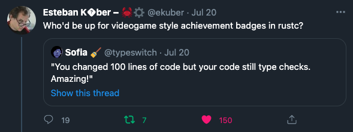

# Gamepiler

The gamepiler *will* be a tool for checking your errors as achievements.

How it started ^^. At least 150 people liked a tool that would gamify their error as achievements (yay! celebrate errors), and 7 (inclusive meself) needed it very badly.

The Gamepiler 🍍 idea was planted.

Right now it is just counting errors and saving them in a file BUUUUUT there is some hope to turn it into a cargo tool.