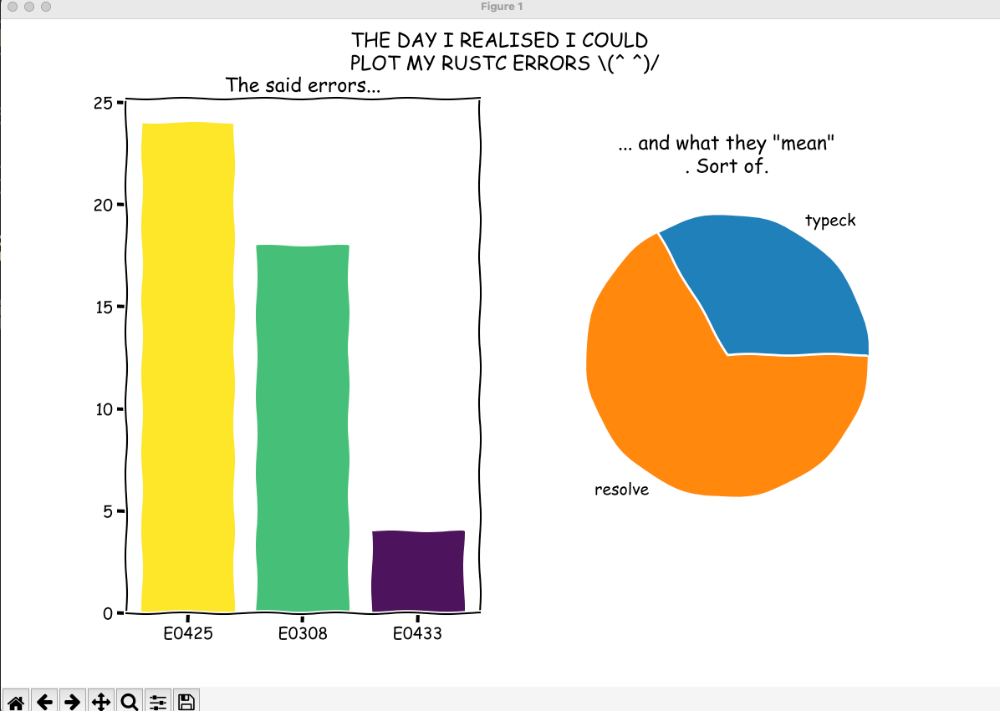

# Gamepiler

## How it started:
The gamepiler *will* be a tool for checking your errors as achievements.

At least 150 people liked a tool that would gamify their error as achievements (yay! celebrate errors), and 7 (inclusive meself) needed it very badly. The Gamepiler 🍍 idea was planted.

Atm the tool just counting errors and saving them in a file, and making some `xkcd` graphs to show the errors accumumation and types, BUUUUUT there is some hope to turn it into a real cargo tool that will give you useful stats.

Your error file will be in the `data local dir`, as per [the default paths from the directory crate](https://github.com/dirs-dev/directories-rs).

## How to try?

You need to download the repository, and install it with nightly:

`cargo +nightly install --path ./.`

You can then go in another directory and run :
- `cargo-gamepile` to get a list of errors, 
- `cargo-gamepile -- --graph`for a graph which is incorrect atm (🙃).

## How does it look like

The graph will end up looking with the errors you made so far, as well as their "category".

The `rustc` error category file has been generously gifted by [Félix Saparelli](https://github.com/passcod) and is available [here](https://gist.github.com/passcod/d31ddd1b81b0d3874ac64a4b300f51ca)!

⚠️ Warning for huge work in progress!! ⚠️ Errors still need to be analyzed to be useful to you.

